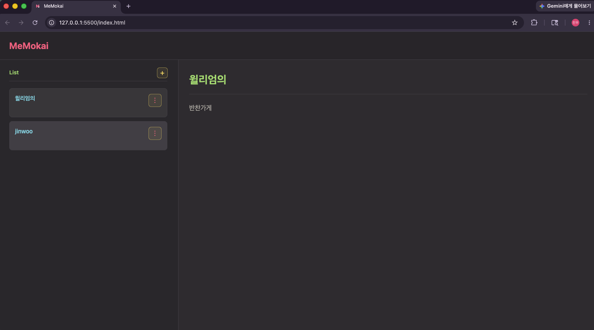
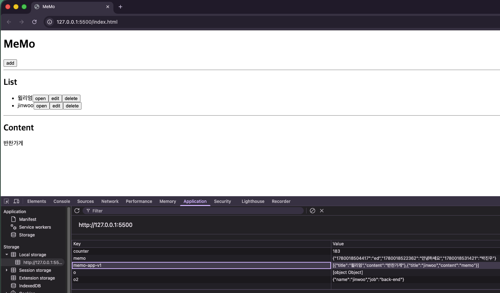
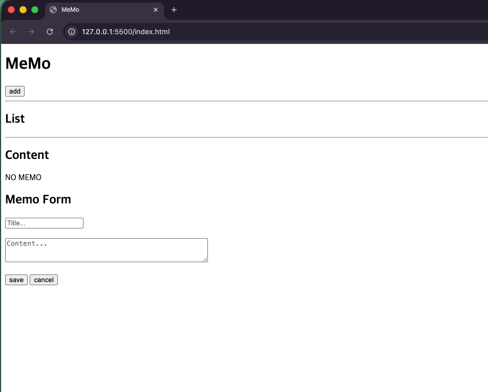

# MeMokai

JavaScript 로직 구현을 중심으로 만든 미니멀 메모 관리 웹 애플리케이션입니다.

메모 CRUD, LocalStorage 저장, Modal 제어, 렌더링 흐름을 직접 구현하며 JavaScript의 기본 동작을 학습하는 데 초점을 두었습니다. 이후 CSS 디자인과 시각적 완성도 개선에는 AI를 적극적으로 활용해 Monokai Pro 분위기의 다크 UI로 발전시켰습니다.

## 기술 스택

- HTML
- CSS
- JavaScript
- LocalStorage

## 주요 기능

- 메모 생성, 조회, 수정, 삭제
- 메모 목록 클릭 시 상세 내용 표시
- `LocalStorage`를 활용한 브라우저 저장
- Add 버튼 기반 메모 작성
- Modal 기반 작성/수정 UI
- 작성 모드와 수정 모드 분리
- Monokai Pro 감성의 다크 테마
- SEO 메타 태그와 favicon 적용

## 구현 초점

이 프로젝트의 핵심은 JavaScript 로직 구현 시도입니다.

직접 구현한 부분:

- 메모 데이터 구조 설계
- CRUD 로직 작성
- `LocalStorage` 저장 및 불러오기
- `renderAll` 기반 목록 재렌더링
- Modal 열기/닫기 제어
- 작성 모드와 수정 모드 분리
- 동적으로 생성된 요소에 이벤트 연결
- 메모 목록 클릭 시 상세 내용 표시

AI를 적극적으로 활용한 부분:

- CSS 레이아웃 개선
- Monokai Pro 스타일의 다크 테마 구성
- 버튼, 카드, 모달 등 UI 스타일링
- README 구성 정리
- SEO 메타 태그 구성 참고

## 버전별 진행 과정

### Version 1

JavaScript를 이용해 기본 CRUD 흐름을 구현했습니다.

- 메모 생성
- 메모 조회
- 메모 수정
- 메모 삭제
- DOM 선택과 이벤트 처리 연습
- 객체와 배열을 활용한 메모 데이터 관리

### Version 2

메모 데이터를 브라우저에 저장하고, LocalStorage에서 다시 불러오는 구조를 적용했습니다.

- `LocalStorage` 연동
- 새로고침 후에도 메모 유지
- 저장된 메모 배열을 다시 렌더링
- 동적으로 생성된 버튼 이벤트 처리

### Version 3

UI/UX를 개선하고 MeMokai 스타일의 완성형 화면으로 다듬었습니다.

- 좌측 메모 목록, 우측 상세 내용 2단 구조
- 목록 카드 클릭으로 메모 열기
- 점 3개 버튼을 통한 수정/삭제 메뉴
- 상세 영역에 제목, 구분선, 내용 표시
- Monokai Pro 기반 다크 테마
- favicon, Open Graph, Twitter Card 등 SEO 요소 적용

CSS 작업은 AI의 도움을 적극적으로 받아 진행했습니다. JavaScript 로직은 직접 구현한 흐름을 유지하면서, 시각적 완성도와 사용성을 높이는 방향으로 스타일을 개선했습니다.

## 초기 화면

처음에는 기본 HTML과 브라우저 기본 스타일에 가까운 형태에서 시작했습니다.

이후 CRUD 로직, 저장소 연동, Modal UI, 테마 스타일을 순서대로 확장했습니다.

## 학습 포인트

- DOM 요소 선택과 조작
- 이벤트 리스너 연결
- 동적으로 생성된 요소에 이벤트 부여
- 배열과 객체를 활용한 데이터 관리
- `LocalStorage`를 이용한 클라이언트 저장
- `renderAll` 기반 화면 재렌더링
- `editingMemo` 상태를 통한 작성/수정 모드 분리
- CSS Grid/Flex를 활용한 레이아웃 구성
- SEO 메타 태그와 favicon 적용

## 회고

처음에는 CRUD 기능을 구현하는 것에 집중했고, 이후 데이터를 저장하고 화면을 다시 그리는 구조를 학습했습니다.

입력창을 항상 노출하는 방식에서 Modal 기반 작성 방식으로 변경하면서 기능뿐 아니라 사용자의 흐름도 함께 고민할 수 있었습니다.

특히 JavaScript로 직접 메모 앱의 동작 구조를 만들어보는 과정이 가장 중요한 학습 포인트였습니다. 이후 CSS는 AI를 적극적으로 활용해 디자인 방향을 잡고, 단순한 기능 구현 결과물을 하나의 작은 웹 애플리케이션처럼 보이도록 다듬었습니다.
